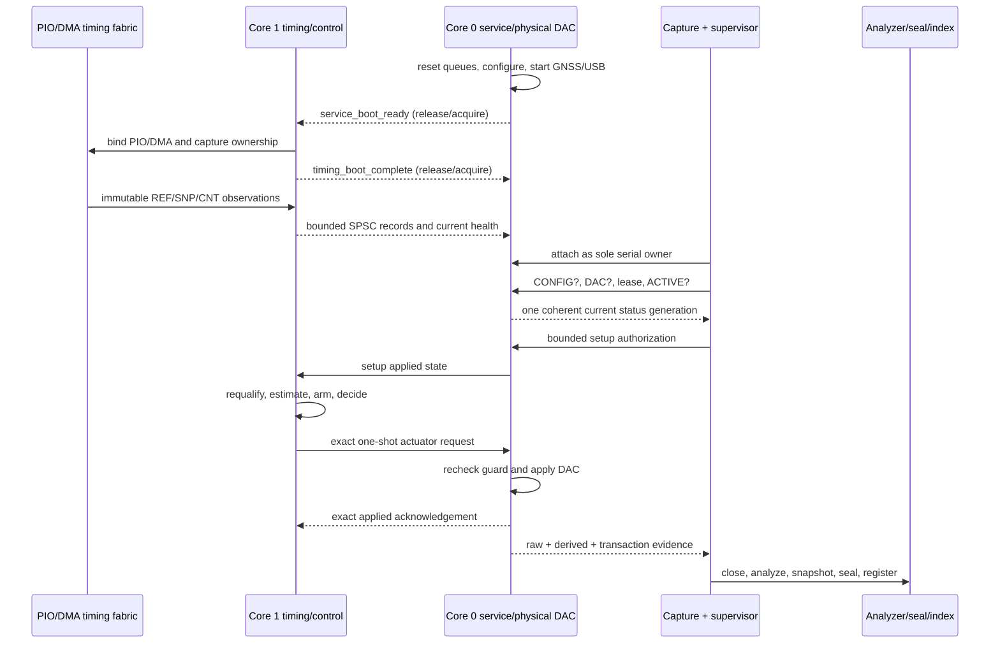

# OTIS Adversarial Architecture Review

Review date: 2026-08-11  
Reviewed repository state: `27d8c0d` (including merge `7b73367`)  
Review authority: read-only except for this report  
Decision: whether the present OTIS architecture is robust across its supported
lifecycle, or is safe and successful only inside a narrowly frozen,
continuously supervised campaign

## Review method and evidence language

This review treated architecture documents and comments as claims until source,
tests, or retained evidence corroborated them. It read the foundation documents,
current firmware and host paths, selected test harnesses, git chronology,
programme reports, and local ignored `runs/` evidence. Three independent review
tracks tried to falsify firmware, host, and historical claims; their material
points were checked against the cited primary sources before inclusion here.

The evidence labels used below are:

- **Observed:** directly present in current source, a retained artifact, or an
  executed check.
- **Derived:** arithmetic or a deterministic consequence of observed inputs.
- **Inference:** the best-supported explanation, but not directly instrumented.
- **Hypothesis:** credible and discriminating, but not yet exercised.

No hardware was opened or manipulated. No serial device was opened, no command
was issued, no firmware was flashed, no evidence was changed or registered, and
no production source was modified. The safe offline checks executed for this
review were:

- `34 passed in 2.29s` for the focused dual-core, frame-arbiter, active-status,
  host-attach, and current prewrite-contract tests;
- external evidence-index validation: `valid=true`, ten packages, all ten
  retained locations exact content matches;
- deterministic host checks showing that an old complete active generation can
  remain command-eligible after a newer incomplete generation reports `FAULT`,
  and that a stale first retained uptime can satisfy the current attachment
  predicate.

Citation convention: an unqualified firmware basename resolves under
`firmware/arduino/otis_nano_rp2040_connect/`; an unqualified host Python basename
resolves under `host/otis_tools/`; and an unqualified C++ harness basename
resolves under `tests/cpp/`. The architecture basenames `CORE_PARTITIONING.md`
and `DIAGNOSTICS_AND_CONFIDENCE_ARCHITECTURE.md` resolve under
`docs/10_REFERENCE_ARCHITECTURE/`; foundation basenames resolve under
`docs/00_FOUNDATIONS/`. Programme and retained-evidence citations are otherwise
written with their full repository-relative path.

## 1. Executive verdict

**Overall verdict: `fragile`.**

OTIS has a credible, well-bounded digital measurement aperture, strong
provenance practices, a sound SPSC queue primitive, and conservative automatic
actuation containment. Those strengths do not establish lifecycle
robustness. Ordinary supported conditions—no host, a capture-owner transition,
serial backpressure, a long startup boundary, or a mixed status generation—have
repeatedly caused queue exhaustion, false receiver epochs, stale authority,
irrecoverable fail-static state, or long non-scientific runs. The current system
is best described as a timing instrument that can produce decision-bearing
results inside an exact, continuously drained, carefully rehearsed bundle. It is
not presently a host-independent, detach/reattach-capable instrument.

`Fail-static` is a real safety property here. It is not a liveness, recovery, or
qualification property.

| Area                         | Verdict                                                             | Supported envelope and decisive limitation                                                                                                                                                                                                                                                                                                                                                                                                                                                                                                                                                                                                                   |
| ---------------------------- | ------------------------------------------------------------------- | ------------------------------------------------------------------------------------------------------------------------------------------------------------------------------------------------------------------------------------------------------------------------------------------------------------------------------------------------------------------------------------------------------------------------------------------------------------------------------------------------------------------------------------------------------------------------------------------------------------------------------------------------------------ |
| Metrology integrity          | `conditionally robust`                                              | Hardware-established digital PPS aperture and canonical raw semantics are strong within the exact PIO/DMA proof-bound configuration. Absolute traceability, calibrated phase, physical delay, PPS pad margin, and combined uncertainty remain explicitly unavailable (`docs/50_SOFTWARE/CURRENT_METROLOGY_CLAIM.md:5-21,71-103`).                                                                                                                                                                                                                                                                                                                            |
| Actuation safety             | `conditionally robust`                                              | Automatic corrections have Core 1 eligibility, exact request/nonce matching, one-time Core 0 application, and fail-static rejection (`firmware/arduino/otis_nano_rp2040_connect/otis_nano_rp2040_connect.ino:780-858`; `otis_cx317_active_live.cpp:550-557,648-666`). Initial setup is weaker: the dual-core path performs a host-authorized one-shot write without rechecking current Core 1/GNSS/lease authority (`.ino:3478-3525`). The independent Core 0 timeout mixes two clock representations after `micros()` wraps, and firmware command parsing is starved by a blocked TX frame. The code remains clamped and inside the characterized envelope. |
| Liveness                     | `fragile`                                                           | Non-droppable timing output depends on Core 0 serial progress. A stuck formatted frame prevents Core 0 from draining observations; the 96-slot raw queue then fails static. Retained ownerless intervals have exhausted raw or evidence queues.                                                                                                                                                                                                                                                                                                                                                                                                              |
| Host independence            | `contradicted`                                                      | Timing capture can continue temporarily, but evidence, control eligibility, and healthy operation cannot. USB-not-ready returns zero capacity (`otis_transport_serial.cpp:26-31`); ordinary pre-attachment raw output is not durably retained; later formatted backlog can irreversibly fault the partition.                                                                                                                                                                                                                                                                                                                                                 |
| Startup determinism          | `fragile`                                                           | The cross-core handshake is bounded to 10 s and Core 0 drains GNSS/status while waiting, but the two sides fail differently and current long qualification timing escaped host verification (`.ino:4103-4161`; `docs/60_EXPERIMENTS/CX319_STABILIZED_TIGHT_DEADBAND_PROGRAMME/15_G1_RECOVERY_HOST_TIMING_STOP.md:34-64`).                                                                                                                                                                                                                                                                                                                                    |
| Recovery                     | `fragile`                                                           | Queue and partition faults latch until reset; active capture disconnect deliberately stops rather than reattaches; campaign recovery relies on reset and owner choreography, not an explicit distributed recovery protocol.                                                                                                                                                                                                                                                                                                                                                                                                                                  |
| Diagnostics non-interference | `contradicted`                                                      | Historical status bursts starved GNSS, overflowed telemetry, interleaved frames, and exceeded the Core 1 stack. Current boot drainage feeds telemetry back into its own SPSC queue, Core 0 diagnostic queries call a mutating Core 1 timing-backend poll, and serialization can convert serial blockage into global Core 0 starvation.                                                                                                                                                                                                                                                                                                                       |
| Evidence integrity           | `conditionally robust`                                              | Content-addressed snapshots, seals, exact identities, explicit failure classifications, and deterministic replay are strong for retained packages. Registration/finalization is not one crash-recoverable transaction, the external index has no interprocess locking, and much historical evidence is local/ignored rather than portable.                                                                                                                                                                                                                                                                                                                   |
| Campaign gating              | `conditionally robust` for containment; `fragile` for qualification | Gates usually prevent automatic movement and preserve failures, but six of seven reviewed CX319 physical entries ended in platform/host/evidence defects rather than a scientific result. The latest operational firmware/host changes have no subsequent physical pass.                                                                                                                                                                                                                                                                                                                                                                                     |

The current architecture is not `structurally unsound`: the hardware capture
aperture, the SPSC primitive, exact automatic request/acknowledgement matching,
raw-evidence semantics, and content-addressed retention are sound foundations.
The missing properties are
system-level lifecycle invariants, not evidence that dual-core timing or OTIS's
measurement model must be abandoned.

### Disposition and root-cause consolidation

The nineteen numbered findings below are retained as traceable evidence and
acceptance criteria; they are not nineteen independent architectural problems.
For remediation and programme decisions, they consolidate into five root
causes.  Disposition terms mean: **accept**—the finding is sufficiently
established to act on; **modify**—retain the evidence but narrow or restate the
claim; **needs experiment**—the source concern is credible but the stated
operational consequence or platform behavior still needs a discriminating
check; **defer**—intentionally outside the present offline corrective scope, not
dismissed.

| Root cause                                                                                                                                                                                                                                                                                    | Supporting findings                      | Disposition                                                                                                                                                                                                                                                                                                                                             | Decision-bearing outcome                                                                                                                                                                        |
| --------------------------------------------------------------------------------------------------------------------------------------------------------------------------------------------------------------------------------------------------------------------------------------------- | ---------------------------------------- | ------------------------------------------------------------------------------------------------------------------------------------------------------------------------------------------------------------------------------------------------------------------------------------------------------------------------------------------------------- | ----------------------------------------------------------------------------------------------------------------------------------------------------------------------------------------------- |
| **RC-1 — Serial progress is coupled to mandatory service and lifecycle liveness.** A retained or blocked formatted frame can suppress queue drainage, command handling, abort delivery, and later lifecycle progress; recovery and serial ownership are chiefly procedural.                   | F-03, F-05, F-06, F-08, F-11, F-15, F-16 | **Accept:** F-03, F-05, F-06, F-11. **Modify:** F-15 is change-sensitivity evidence for this root cause, not a separate defect. **Needs experiment:** F-08 hostile-input schedulability and F-16 platform-specific exclusivity. **Defer:** an on-device durable spool or indefinite hostless operation unless OTIS explicitly adopts that product goal. | Choose and document the host/carrier dependency; bound mandatory service and abort independently of TX progress; declare permitted consumer absence, fault transition, and recovery semantics.  |
| **RC-2 — Cross-core ownership is not enforced at startup and diagnostic boundaries.** Boot telemetry violates the SPSC producer topology, and Core 0 queries can inspect or mutate Core 1 timing state; the resource ledger no longer describes the implementation.                           | F-01, F-02, F-19                         | **Accept:** all three findings.                                                                                                                                                                                                                                                                                                                         | Restore one producer per SPSC queue; provide immutable generation-bound Core 1 diagnostic snapshots; mechanically check the complete queue/resource inventory.                                  |
| **RC-3 — Initial setup authority is neither one coherent current generation nor replayable end to end.** Attachment, readiness, command transmission, firmware acceptance, physical application, failure detection, and analyzer proof are not one correlated transaction.                    | F-04, F-10, F-13, F-14, F-18             | **Accept:** F-04, F-13, F-14, F-18. **Modify:** accept F-10's missing causal attachment boundary; the exact stale-`<=120` physical occurrence remains unobserved and **needs experiment**.                                                                                                                                                              | Make setup a nonce-, session-, generation-, and expiry-bound firmware authorization; distinguish written/received/accepted/applied/failed states; retain and replay the exact authority inputs. |
| **RC-4 — The actuator transaction compares incompatible clock representations.** The Core 0 independent deadline does not remain valid across the wrapping `micros()` domain.                                                                                                                 | F-07                                     | **Accept:** source establishes the mixed representation; the repaired path still needs an explicit cross-wrap verification.                                                                                                                                                                                                                             | Use one named clock representation and wrap-safe comparison for request creation and both guards, then exercise every supported duration and rollover.                                          |
| **RC-5 — Qualification and evidence finalization do not yet close the current integrated lifecycle claim.** Existing tests omit decisive distributed schedules, the latest bundle lacks a subsequent physical pass, and finalization/index registration is not one crash-recoverable process. | F-09, F-12, F-17                         | **Accept:** F-12 and F-17. **Modify:** F-09 is a qualification gap, not by itself a source defect. **Needs experiment:** exact-bundle real-I/O rehearsal and physical no-write qualification. **Defer:** any renewed live-actuation verdict until the earlier gates pass under explicit authority.                                                      | Add adversarial schedule coverage and crash/fault-injected finalization; preserve the primary verdict; complete the authorized Q1-Q3 evidence before considering a finite live qualification.   |

## 2. Strongest falsifying evidence

### 2.1 Boot drainage violates the telemetry queue's single-producer contract

**Observed:** The queue primitive requires one producer to own `tail_` and one
consumer to own `head_`; publication uses ordinary atomic load/store, not a
multi-producer compare/exchange (`otis_spsc_queue.h:8-13,29-38`). Core 1 sets
`dual_core_timing_boot_in_progress`, emits boot status, and later clears it
(`otis_nano_rp2040_connect.ino:4147-4160`). While that flag is true, the sketch's
generic `emit_status()` sends every status record into `telemetry_to_service`
(`:376-390`).

Core 0 concurrently calls `service_dual_core_outputs()` in the boot wait
(`:4103-4117`). That consumer pops telemetry and calls the same `emit_status()`
for each record (`:912-923`). Because the boot flag is still true, Core 0 pushes
the record back into the queue. Core 1 and Core 0 are therefore concurrent
producers for an SPSC queue, and Core 0 drainage has no net draining effect until
the flag clears.

**Derived:** An interleaving in which both cores load the same `tail_`, write
different slots/records, then store `tail_ + 1` can lose a record. Independently
of that race, pop-then-republish prevents the intended drain while Core 1's boot
burst continues to accumulate. G2 v6
observed telemetry high-water exactly 192 and three pre-attachment drops
(`docs/60_EXPERIMENTS/CX319_STABILIZED_TIGHT_DEADBAND_PROGRAMME/09_G2_V6_PREWRITE_TELEMETRY_STOP.md:28-41`). That artifact is compatible with
the mechanism but does not by itself establish it as the cause.

This directly contradicts the claim that all cross-core queue use is SPSC and
immutable-by-publication. The primitive is sound; the boot call graph violates
its precondition.

### 2.2 A Core 0 diagnostic query can poll and mutate the Core 1 timing backend

**Observed:** Core 0 dispatches `FC0?` by calling count-runtime/status functions
directly on shared `runtime_state` (`otis_nano_rp2040_connect.ino:3831-3836`),
and the first `CONFIG?` directly calls the count configuration-status path
(`:3615-3625`). These functions read multiple mutable Core 1-owned count fields
without a generation (`otis_count_observation.cpp:384-545,1798-1937`).

Both status paths call `otis_pps_snapshot_backend_get_stats()`. That nominal
getter first calls `otis_pps_snapshot_backend_poll()`
(`otis_pps_snapshot_backend.cpp:319-335`). Polling changes high-water/counters
and consumer position on overwrite; on PIO/DMA anomalies it latches a fatal
fault and stops the transport (`:235-271`). Core 1 calls the same poll/pop path
during normal timing service.

**Consequence:** A diagnostic Core 0 query is neither an immutable request nor a
read-only snapshot. It can race with, inspect, and mutate the timing backend,
contradicting Core 1 ownership and diagnostics non-interference. Boundary-ring
getters use `noInterrupts()` (`otis_pps_count_boundary_ring.cpp:98-124`), which
does not exclude the other core or form a coherent multi-field generation.

No retained failure has been causally assigned to this path. The source is
sufficient to establish the ownership violation; the operational consequence
needs an adversarial schedule check.

### 2.3 A host-independent instrument becomes unhealthy when the host is absent

**Observed:** Current code has a 96-entry non-droppable Core 1-to-Core 0
observation queue (`otis_dual_core_partition.h:8-12`). A current CX319 run
contains 5,424 data rows in each of
`runs/cx319_stabilized_tight_deadband/g2/live_leg_a_v7_20260811T170842Z/csv/raw_events.csv`,
`runs/cx319_stabilized_tight_deadband/g2/live_leg_a_v7_20260811T170842Z/csv/pps_snapshots.csv`,
and
`runs/cx319_stabilized_tight_deadband/g2/live_leg_a_v7_20260811T170842Z/csv/count_observations.csv`,
consistent with three non-droppable observations per one-second aperture.
Source independently shows the three publications:
reference edge (`otis_nano_rp2040_connect.ino:1073-1119`), snapshot
(`:1443-1479`), and count (`otis_count_observation.cpp:895-914`).

With no USB connection, available serial capacity is zero
(`otis_transport_serial.cpp:26-31`). Once any chunked evidence/preview frame is
pending, Core 0 claims it, retains it while capacity is zero, and returns before
`service_dual_core_outputs()` (`otis_nano_rp2040_connect.ino:927-998,4225-4247`).
Core 1 continues publishing observations.

**Derived:** From an empty queue, `96 records / 3 records/s = 32 s` from a pinned
frame to capacity; the next record latches `ObservationExhausted`. This is not a
claim that the fault occurs exactly 32 s after power-on: the first chunked frame
must first become pending and preexisting queue depth shortens the interval.

**Observed counterevidence:** CX318 recorded a raw-observation queue failure and
3,328 drops after an ownerless interval, and another failure after roughly 50 s
without a host (`runs/cx318_relative_phase_hybrid_preview/campaign_20260808T110942Z/PROGRAMME_STATE.md:193-201,215-217`). CX319 G2 v5 recorded an
evidence-queue high-water of 8 and latched `evidence_queue_exhausted` after a
4,647 s ownerless interval (`docs/60_EXPERIMENTS/CX319_STABILIZED_TIGHT_DEADBAND_PROGRAMME/06_G2_PREWRITE_PLATFORM_STOP.md:29-49`).

This directly contradicts host-independent healthy operation. Hardware capture
may continue, and fail-static prevents automatic actuation, but raw durability,
availability, control eligibility, and reattachment do not survive.

### 2.4 The initial physical setup write is not authorized by one current state

**Observed:** The current G2 v5 host predicate checks exact GNSS fields
(`bounded_tight_deadband_prewrite_contract.py:37-89`), but its health map combines
one completed `cx317_active` generation with unrelated latest values for every
other component (`active_status_contract.py:63-138`). An older complete active
generation remains selectable while a newer generation is incomplete; tests
explicitly require that behavior (`tests/test_active_status_contract.py:46-64`).

The supervisor issues setup from this map (`tight_deadband_supervisor.py:424-458,
628-680`). In the current dual-core firmware branch, `handle_dac_set()` checks
only the exact profile start code and one-shot-consumed flag before calling the
physical DAC driver (`otis_nano_rp2040_connect.ino:3478-3525`). The stronger
`otis_cx317_active_live_manual_start_allowed()` call is in the non-dual-core
`#else`, and even that helper does not check current GNSS, capture lease, or
partition health (`otis_cx317_active_live.cpp:766-775`). Core 1 learns of the
manual application later through periodically published applied-DAC state
(`otis_nano_rp2040_connect.ino:1154-1242`).

**Executed counterexample:** A complete healthy active generation 1 followed by
an incomplete generation 2 containing `state=FAULT` yielded
`selected_generation=1`, `selected_state=DISARMED`, and `prewrite_ready=True`.

**Consequence:** A GNSS, lease, active-state, or partition regression between
host evaluation and Core 0 command consumption does not prevent the one exact
setup write. The write remains one-shot, clamped, and inside the established
electrical envelope, so this is a high-confidence authority/provenance defect,
not evidence of an out-of-range physical hazard. Automatic corrections use a
stronger path and are not implicated by this counterexample.

### 2.5 Diagnostics have repeatedly participated in the fault they report

The following are observed, not hypothetical:

- CX317 status output starved GNSS service; later a 93-record periodic burst
  aligned with a 22-record query burst against a 96-entry telemetry queue
  (`runs/cx317_bounded_closed_loop_acquisition/campaign_20260803T080615Z/PROGRAMME_STATE.md:158-165,292-301`).
- CX318 recorded 72 cross-stream rejected lines, a lost handoff snapshot, and a
  522-byte CTL formatter path using more than 9 KiB on an 8 KiB Core 1 stack,
  corrupting a live record (`runs/cx318_relative_phase_hybrid_preview/campaign_20260808T110942Z/PROGRAMME_STATE.md:193-217`).
- CX319 G2 v7's initial serial-output burst starved GNSS for more than the 10 s
  receiver gap, manufactured identity epoch 2, yet the then-current host gate
  permitted `DAC SET 0xA808` and a 90-minute run
  (`docs/60_EXPERIMENTS/CX319_STABILIZED_TIGHT_DEADBAND_PROGRAMME/13_G2_V7_GNSS_IDENTITY_QUALIFICATION_STOP.md:24-64`).

The latest firmware moves GNSS drainage before the serial-frame early return,
which repairs that exact starvation. The architecture still places
non-droppable formatted output on a path that can suppress observation drainage,
commands, sensors, metadata, and periodic status. The failure class moved
surfaces; it did not disappear.

### 2.6 Verification repeatedly passed before ordinary integration defects escaped

CX317 reported 790 passing tests and 22 supported/seven guarded profiles while
its manifest-bearing active history contained 36 attempts: 24 aborted, one
fault, seven healthy stops, four unavailable; 12 complete evidence packages, 14
partial, and ten missing (`docs/60_EXPERIMENTS/CX317_BOUNDED_CLOSED_LOOP_ACQUISITION_FINAL_REPORT.md:38-77,283-293`). CX318 passed 963 tests before ownerless startup, stack,
field, and schema failures. Platform stabilization passed 987 tests and a
Release matrix before two short bench attempts found missing queryable state
(`docs/60_EXPERIMENTS/OTIS_PLATFORM_STABILIZATION_COMPLETION_REPORT.md:43-77`).

The current focused suite also passes while the two present-code
counterexamples above remain. This demonstrates a verification-class gap:
contract and single-order harnesses are useful, but they are not adversarial
distributed-schedule evidence.

## 3. Claim-to-evidence matrix

`Proven` below means directly established only for the named bounded mechanism;
it never means universal physical correctness.

| Claimed invariant and authority                                                                                                                                                          | Current mechanism and dependencies                                                                                                                                                                 | Direct support                                                                                                                                                          | Counterevidence / limit                                                                                                                                                                                                                                                                                                                  | Assessment; confidence                                                                       |
| ---------------------------------------------------------------------------------------------------------------------------------------------------------------------------------------- | -------------------------------------------------------------------------------------------------------------------------------------------------------------------------------------------------- | ----------------------------------------------------------------------------------------------------------------------------------------------------------------------- | ---------------------------------------------------------------------------------------------------------------------------------------------------------------------------------------------------------------------------------------------------------------------------------------------------------------------------------------- | -------------------------------------------------------------------------------------------- |
| Hardware capture establishes timing truth (`docs/00_FOUNDATIONS/OTIS_ARCHITECTURE_OVERVIEW.md:40-51`; `docs/10_REFERENCE_ARCHITECTURE/CORE_PARTITIONING.md:17-24`)                       | PIO wait/cumulative snapshot + DMA; RP2040 timer-domain raw edge capture; Core 1 reconstruction. Depends on unchanged PIO word, clock/divider, synchronizer, pin, FIFO, DMA, snapshot association. | 7,936 phase/duty cases, 55,552 adjacent intervals, one-edge span bound, and 16,798 clean overnight windows (`docs/50_SOFTWARE/CURRENT_METROLOGY_CLAIM.md:23-46,71-87`). | No physical pad-margin or traceable comparison; IRQ variant and diagnostics do not define timestamp truth.                                                                                                                                                                                                                               | **Supported within the exact digital envelope; high.**                                       |
| Core 1 owns timing/control state; Core 0 owns service and physical DAC (`docs/10_REFERENCE_ARCHITECTURE/CORE_PARTITIONING.md:36-48`)                                                     | `setup1/loop1` initializes and services timing; Core 0 parses GNSS/commands, emits serial, and calls DAC I2C (`.ino:4039-4247`).                                                                   | Resource/build guards and dual-core harnesses; exact owner registry (`docs/50_SOFTWARE/HARDWARE_RESOURCE_OWNERSHIP.md:17-42,88-110,147-190`).                           | Core 0 `CONFIG?`/`FC0?` directly reads timing-owned `runtime_state` and calls a “get stats” path that polls/mutates the PIO/DMA backend. Initial setup authority is also evaluated outside Core 1.                                                                                                                                       | **Contradicted at the diagnostic and setup boundaries; high.**                               |
| Host is not timing authority and firmware is host-independent (`docs/50_SOFTWARE/HOST_ARCHITECTURE.md:23,62,73-84`; `docs/10_REFERENCE_ARCHITECTURE/CORE_PARTITIONING.md:78-84,163-185`) | Hardware capture and Core 1 run without host; Core 0 attempts serial and queues bounded output.                                                                                                    | Timing continued during observed service faults; capture timestamps do not come from host.                                                                              | Zero USB capacity pins framed output; queues exhaust and fail static; raw preattach output is not durably retained; 50 s, nine-minute, and 4,647 s ownerless failures.                                                                                                                                                                   | **Timing-origin independence supported; healthy lifecycle independence contradicted; high.** |
| Cross-core communication is immutable SPSC                                                                                                                                               | Six fixed queues copy trivially-copyable values; release/acquire ownership (`otis_spsc_queue.h:8-78`; `otis_dual_core_partition.cpp:9-20`).                                                        | Native queue and partition harnesses, including capacity and overflow.                                                                                                  | During boot Core 0 pops telemetry and republishes it into the same queue while Core 1 is also producing (`.ino:376-390,912-923,4103-4160`), violating SPSC and potentially losing records. Core 0 also accesses timing state outside queues.                                                                                             | **Primitive proven in its model; current architecture contradicted; high.**                  |
| Core behavior is bounded and non-blocking (`CORE_PARTITIONING.md:96-126,130-159`)                                                                                                        | Core 1 avoids serial/I2C; Core 0 drains raw 24, critical 8, telemetry 12 per pass and serial chunks to 192 bytes. GNSS drains 32 bytes/service.                                                    | Source guards and deterministic load harness retain 48 or 60 raw records.                                                                                               | Frame ownership has no elapsed-time bound when serial capacity is zero; Core 0 early-return skips most services. Core 1 capture drains use `while` loops, and environment I2C has synchronous calls plus `delay(10)`.                                                                                                                    | **Contradicted as a system-wide maximum-service claim; high.**                               |
| Exactly one serial owner and continuous bounded drainage (`docs/50_SOFTWARE/HOST_ARCHITECTURE.md:138-155,220-244`)                                                                       | `capture_device` owns one serial handle; same-owner logical rotation starts the new sink before closing the old sink; emergency FIFO is independent of normal FIFO.                                | Platform rehearsal obstruction/abort/rotation and capture PID continuity (`docs/60_EXPERIMENTS/OTIS_PLATFORM_STABILIZATION_COMPLETION_REPORT.md:79-112`).               | Initial serial open does not request pyserial `exclusive=True`; `lsof` owner verification occurs only during rotation (`capture_device.py:838-891,1000-1042,1082-1095`). Legacy handoff creates an ownerless gap. Historical long-run normal and abort paths both blocked.                                                               | **Supported only under frozen capture choreography; medium-high.**                           |
| Diagnostics cannot affect timing/control correctness (`docs/10_REFERENCE_ARCHITECTURE/DIAGNOSTICS_AND_CONFIDENCE_ARCHITECTURE.md:67-69,158-169`)                                         | Timing capture is on Core 1/PIO; telemetry queue is droppable; critical evidence is separated.                                                                                                     | Raw aperture survived some service load; drop counters and fail-static make faults visible.                                                                             | GNSS starvation, queue overflow, cross-stream interleaving, Core 1 formatter stack overrun, boot queue feedback, Core 0 mutating timing queries, and current frame-induced observation starvation.                                                                                                                                       | **Contradicted; high.**                                                                      |
| Canonical raw observations are preserved unchanged (`docs/00_FOUNDATIONS/OTIS_DESIGN_PRINCIPLES.md:47-61`; `docs/50_SOFTWARE/EVIDENCE_LIFECYCLE.md:5-22`)                                | Raw REF/SNP/CNT generated before derived estimates; host append-only capture; immutable snapshot manifest and seal.                                                                                | Current external index validates ten exact packages; failed runs are registered and retained.                                                                           | No host means no durable raw archive; direct serial output attempted while disconnected is not a preattach history buffer. Some historical attempts are partial/missing; `runs/` is intentionally outside Git.                                                                                                                           | **Strong for captured/sealed packages, untrue for arbitrary host absence; high.**            |
| Replay is deterministic and reconstructs decisions                                                                                                                                       | Versioned estimator/policy identities, canonical records, analyzer and supersession rules (`docs/50_SOFTWARE/EVIDENCE_LIFECYCLE.md:95-117`).                                                       | Exact replay is demonstrated for retained automatic decisions and analyzer-only repairs.                                                                                | Current setup analyzer trusts the supervisor's readiness result/timestamps rather than reconstructing its exact source generation (`bounded_tight_deadband_live_analyze.py:327-352`; `tight_deadband_supervisor.py:274-303`).                                                                                                            | **Supported for numerical/automatic paths; contradicted for initial setup authority; high.** |
| Actuation fails static and every action is reconstructable (`docs/00_FOUNDATIONS/OTIS_ARCHITECTURE_OVERVIEW.md:58-68,70-83`)                                                             | Capture lease, bounded transaction, evidence release, exact request/ack, no retry/restore; partition faults inhibit automatic application.                                                         | Source and native actuator tests; observed failures generally held last code and never armed.                                                                           | Setup uses a weaker host/Core 0 path; host calls serial write `command_acknowledged`; exact authorizing health is not retained. A blocked TX frame prevents firmware command parsing, including `ACTIVE ABORT`. Core 0's independent deadline compares a `millis()`-derived extended tick with wrapping `micros()` ticks after ~4,295 s. | **Conditionally robust only inside the exercised transport/time envelope; high.**            |
| Startup is deterministic and safe                                                                                                                                                        | 10 s release/acquire handshake; Core 0 drains GNSS and output while waiting; Core 1 owns timing initialization (`.ino:4039-4161`).                                                                 | Source guards; later GNSS-before-return repair `9ddf390`; startup timing repair `a024fd2`.                                                                              | Core 1 silently returns if Core 0 misses 10 s while Core 0 later halts; host 30 s timeout contradicted firmware 600 s inhibit; no current physical requalification.                                                                                                                                                                      | **Bounded mechanism, lifecycle result unqualified; high.**                                   |
| Recovery is explicit                                                                                                                                                                     | Safe mode exposes diagnostics; active continuity loss faults; capture closes fail static; operator can reboot/requalify.                                                                           | Failures preserve first fault and prevent automatic retry.                                                                                                              | Queue faults clear only in boot reset (`otis_dual_core_partition.cpp:251-288,433-443`); active serial disconnect stops; detach/reattach and state reconciliation are not implemented as normal transitions.                                                                                                                              | **Safe stop supported; recovery contradicted as a lifecycle property; high.**                |
| Qualification distinguishes preflight, rehearsal, and physical evidence (`AGENTS.md`; `VERIFICATION_AND_PROFILE_LIFECYCLE.md`)                                                           | Frozen bundles, matrix profiles, simulated rehearsals, physical reports, seals.                                                                                                                    | Exact identities and failed-attempt preservation are unusually strong.                                                                                                  | Some “operational rehearsals” open no serial and manufacture state; ordinary host defects first appeared in long physical acquisition. Current source changed after the last physical stop.                                                                                                                                              | **Process intent strong; execution conditionally supported; high.**                          |

### Documented versus actual queue inventory

`CORE_PARTITIONING.md:50-58` documents four queues and says redundant telemetry
depth is 96. Current source declares **six** queues and telemetry depth **192**:

| Actual queue               |       Direction | Current depth | Documented?                      |
| -------------------------- | --------------: | ------------: | -------------------------------- |
| `service_to_timing`        | Core 0 → Core 1 |            16 | Yes                              |
| `observation_to_service`   | Core 1 → Core 0 |            96 | Yes                              |
| `critical_to_service`      | Core 1 → Core 0 |            16 | Yes                              |
| `evidence_to_service`      | Core 1 → Core 0 |             8 | No                               |
| `phase_preview_to_service` | Core 1 → Core 0 |            32 | No                               |
| `telemetry_to_service`     | Core 1 → Core 0 |           192 | Yes, wrong depth (96 documented) |

The authoritative implementation is
`otis_dual_core_partition.h:8-41` and `.cpp:9-20`. This is not cosmetic: the two
omitted non-droppable queues have caused ownerless lifecycle failures.

## 4. Actual lifecycle model

### 4.1 Intended sequence



The automatic-correction portion largely implements this intent. The attach and
initial-setup portion does not: there is no whole-system snapshot generation and
no firmware-side setup authorization transaction.

### 4.2 Actual distributed transitions

| Transition                         | Binding/atomicity                                                                                                                                                                                                 | What can diverge                                                                                                                                                                                                                                                         |
| ---------------------------------- | ----------------------------------------------------------------------------------------------------------------------------------------------------------------------------------------------------------------- | ------------------------------------------------------------------------------------------------------------------------------------------------------------------------------------------------------------------------------------------------------------------------ |
| Reset → service ready              | Core 0 initializes globals and queues, then release-stores `dual_core_service_boot_ready`; Core 1 acquire-loads it.                                                                                               | If Core 1 times out, it returns without latching the fault itself; Core 0 later latches/halt if its opposite wait expires. Recovery is reset.                                                                                                                            |
| Service ready → timing owner       | Core 1 release/acquire flag plus resource ownership; Core 1 initializes timer/PPS/preview.                                                                                                                        | While Core 1 emits boot telemetry, Core 0's attempted drain republishes each record into the same queue, making both cores producers and defeating SPSC. Completion also depends on the 10 s handshake.                                                                  |
| Receiver bytes → qualification     | Core 0 drains up to 32 bytes/service, parses identity/epochs, copies immutable qualification to Core 1.                                                                                                           | Any Core 0 early-return latency changes parser freshness and identity epochs even though PPS capture continues.                                                                                                                                                          |
| GNSS outage → recovery             | Short fix/checksum loss can recover after fresh RMC/GGA/GSA. An outage beyond the reconnect gap increments `identity_epoch`; `identity_stable` is true only for epoch 1 (`otis_gnss_receiver.cpp:80-87,300-315`). | A later epoch cannot become active-programme authority in the same boot/run; the host also requires exact epoch 1 (`no_write_prewrite_readiness_contract.py:38-50`). Recovery is an explicit fresh run/reset, not in-place receiver requalification.                     |
| Observation → host record          | Core 1 publishes by value; Core 0 drains and formats; host captures.                                                                                                                                              | Hardware observation, queued record, transmitted record, and durable record are distinct. With no host, direct output may be discarded; with a pinned frame, queues accumulate and fault.                                                                                |
| Diagnostic query → status          | Core 0 handles `CONFIG?`/`FC0?` synchronously.                                                                                                                                                                    | It reads Core 1-owned state without one generation and calls a backend getter that polls/mutates PIO/DMA status; “query” is not read-only.                                                                                                                               |
| Host attach → baseline             | Capture opens serial; supervisor selects first retained active uptime/drop rows.                                                                                                                                  | There is no causally solicited post-open boundary. Buffered old active generations can precede current system state.                                                                                                                                                     |
| Status → prewrite ready            | One complete active generation plus latest unversioned rows from other components.                                                                                                                                | A new partial active fault or newer GNSS/partition transition can coexist with an older eligible generation. No global query token binds them.                                                                                                                           |
| Ready → setup write                | Host enqueues bytes; capture reports bytes written; Core 0 checks exact code/one-shot and performs I2C.                                                                                                           | Host calls transmission “acknowledged.” Core 1 current authority is neither carried nor rechecked; applied state arrives later.                                                                                                                                          |
| Applied setup → active transaction | Core 1 periodically receives applied state and recognizes the exact start code.                                                                                                                                   | I2C failure detection on the host is unreachable (`cx317_bounded_active_supervisor.py:758-770`), so the host can wait until a long deadline.                                                                                                                             |
| Automatic decision → application   | Core 1 rechecks continuity, publishes exact request; Core 0 exact-matches guard and deadline; Core 1 receives ack.                                                                                                | This is the strongest distributed transaction in the system. Loss/mismatch becomes fail-static; no retry.                                                                                                                                                                |
| Abort / automatic deadline         | Host priority FIFO sends `ACTIVE ABORT`; Core 0 parses it into the service queue. Each core keeps an actuator guard.                                                                                              | A pinned TX frame prevents Core 0 command parsing. Core 0 compares a `millis()`-derived extended deadline with wrapping `micros()` ticks, so its independent timeout does not expire correctly after the ~4,295 s wrap. Core 1 retains a separate seconds-based timeout. |
| Detach/disconnect                  | Active capture closes and stops; lease expires after 30 s; output continues.                                                                                                                                      | No reattach reconciliation. Non-droppable queues can fault. The last physical code is held, but availability is lost.                                                                                                                                                    |
| Campaign handoff                   | Current CX319 same-owner logical segment rotation is atomic at the serial-handle level.                                                                                                                           | Closing the carrier creates an ownerless interval. Legacy `capture_owner_handoff.py` intentionally has a bounded no-owner gap.                                                                                                                                           |
| Fault → recovery                   | First partition fault is latched; actuation inhibited.                                                                                                                                                            | No runtime queue flush/rebind/replay transition. Reboot loses internal state and starts new sessions/epochs; host must establish a new exact run.                                                                                                                        |
| Stop → evidence finalization       | Capture closes, analyzer runs, snapshot/seal/register follow.                                                                                                                                                     | These are multiple host transactions. Registration failure can leave a valid sealed package unregistered or mask the primary failure.                                                                                                                                    |

### 4.3 Credible failing interleaving from current code

```mermaid
sequenceDiagram
    participant C1 as Core 1
    participant Q as Cross-core queues
    participant C0 as Core 0
    participant USB as USB/host
    participant DAC as Physical DAC

    C1->>Q: publish formatted frame and observations
    C0->>Q: claim one formatted frame
    USB--xC0: unavailable or zero write capacity
    C0->>C0: frame remains active
    loop each Core 0 pass
        C0->>C0: drain GNSS (current repair)
        C0->>C0: retry frame, then early return
        Note over C0: no observation drain, commands, sensors, metadata, status
        C1->>Q: REF + SNP + CNT continue (~3/s)
    end
    Q-->>C1: observation capacity reached in ~32 s from empty
    C1->>Q: next publish fails; latch fail-static
    USB->>C0: host later attaches
    C0-->>USB: stale backlog/current status mix
    Note over C0,C1: fault cannot clear without reset

    USB->>C0: alternatively, old complete status says ready
    C1->>Q: newer partial status says FAULT / GNSS regresses
    USB->>C0: DAC SET exact setup code
    C0->>DAC: one-shot write; no current Core 1 authority check
    C0-->>USB: host byte write had already been called acknowledged
    C0-->>C1: applied state observed later
```

The first half is an availability/liveness failure with safe containment. The
second half is a bounded but non-reconstructable authority failure. They may
occur separately; the diagram combines them to show the missing lifecycle
boundaries, not to claim that this exact composite has been observed.

## 5. Concurrency and queue analysis

### 5.1 Ownership and shared-state inventory

The queue primitive has copy-by-value publication, release/acquire ordering, and
no post-publication mutation (`otis_spsc_queue.h:8-78`). Its correctness requires
exactly one producer and one consumer. Normal runtime paths mostly follow that
rule, but boot telemetry does not: Core 0's consumer republishes into the same
queue while Core 1 is producing. The ordinary tail load/store is not safe for
that multi-producer interleaving. Queue counters use wrapping unsigned
subtraction; because a correct single producer stops at capacity, normal
operation cannot lap the consumer by `2^32`, but rollover has not been
schedule-tested.

State crosses cores outside those queues:

- boot flags `dual_core_service_boot_ready`, `dual_core_timing_boot_complete`,
  and `dual_core_timing_boot_in_progress` are global booleans accessed only with
  explicit atomics in startup (`.ino:96-101,4039-4161`);
- partition fault, fail-static, timing-owner flag, breadcrumbs, and counters are
  module globals accessed through atomics (`otis_dual_core_partition.cpp:22-45,
  251-328,433-443`);
- Core 0 owns `dual_core_static_code`; it crosses to Core 1 as an immutable
  service message and Core 1's current copy is used for health and manual-start
  recognition (`.ino:110-111,1154-1242`);
- Core 1 owns estimator/controller state inside its modules; Core 0 owns the
  physical actuator guard/application. The automatic transaction crosses only
  in exact messages;
- `runtime_state` is a global aggregate initialized by Core 0 and then used by
  timing/count code and Core 0 DAC/status emission (`.ino:82,4039-4043`). The
  intended field partition is not expressed as a type boundary. `FC0?` reads its
  mutable Core 1-owned count fields directly, and `CONFIG?`/`FC0?` invoke the
  snapshot backend's mutating poll from Core 0. This is a concrete ownership and
  concurrent-access defect, not merely a missing type proof;
- the Core 0 actuator guard receives deadlines constructed from Core 1
  `millis()/1000` seconds multiplied by 16 MHz, but obtains `now_ticks` from
  `micros()*16`. The latter wraps after 4,294.967296 seconds because the cast to
  `uint64_t` occurs after `micros()` (`otis_timebase.h:12-19`), so the two values
  cease to share one representation.

Queue reset uses relaxed stores and is correct only at reset before either core
publishes. There is no live reset/recovery protocol, which avoids unsafe
mid-flight reuse but makes faults reboot-recoverable only.

### 5.2 Queue and ring budget

| Buffer                  | Producer / consumer                                                                          | Rate or maximum burst                                                                                                                                                                                  | Capacity and service                                                                                                                                                 | At capacity / recovery                                                                                                                                                                                    |
| ----------------------- | -------------------------------------------------------------------------------------------- | ------------------------------------------------------------------------------------------------------------------------------------------------------------------------------------------------------ | -------------------------------------------------------------------------------------------------------------------------------------------------------------------- | --------------------------------------------------------------------------------------------------------------------------------------------------------------------------------------------------------- |
| Service → timing        | Core 0 / Core 1                                                                              | GNSS qualification, applied-DAC state, run-control and queries; burst depends on command/GNSS cadence and has no declared composite maximum.                                                           | 16; Core 1 drains at most 16 each loop (`.ino:597-602`).                                                                                                             | Non-droppable; freezes service-fault breadcrumb and latches fail-static (`partition.cpp:298-329`). Reset required. No declared maximum host command burst proves margin.                                  |
| Observation → service   | Core 1 / Core 0                                                                              | Current nominal 1 PPS profile: one REF + one SNP + one CNT per accepted aperture = ~3/s. At the allowed 0.8 s minimum accepted interval this is 3.75/s; additional configured event channels add rate. | 96; Core 0 drains up to 24 per non-frame pass (`.ino:862-891`; `otis_config.h:496-520`).                                                                             | Non-droppable fail-static. Empty-to-full latency is 32 s at nominal 1 PPS or 25.6 s at the allowed interval minimum during complete consumer suppression. Reset required.                                 |
| Critical → service      | Core 1 / Core 0                                                                              | State/fault transitions and actuator requests; event-driven, no complete maximum-burst contract.                                                                                                       | 16; Core 0 drains up to 8/pass (`.ino:893-911`).                                                                                                                     | Non-droppable fail-static; actuator request may be rejected. Reset required.                                                                                                                              |
| Evidence → service      | Core 1 / Core 0                                                                              | Formatted active transaction and association-loss frames; active workflow can generate multiple evidence phases.                                                                                       | 8; Core 0 removes one into a 1,536-byte active buffer and transmits at most 192 bytes/pass.                                                                          | Non-droppable fail-static. While USB is absent the active frame never completes and the queue stops draining. Observed capacity/high-water failure.                                                       |
| Phase preview → service | Core 1 / Core 0                                                                              | One grouped RPH/PHE/HPR message is published on every processed PPS boundary (`otis_phase_preview_live.cpp:185-193,237-297`): nominally 1/s, up to 1.25/s at the allowed 0.8 s interval minimum.       | 32 queued plus one already removed into the active chunked transport buffer.                                                                                         | Non-droppable `PhasePreviewQueueExhausted`; with a pinned active frame, the 33rd new message fails after about 33 s nominal or 26.4 s at 0.8 s intervals. Reset required. Document inventory omits it.    |
| Telemetry → service     | Nominally Core 1 / Core 0; during boot Core 0 also republishes and becomes a second producer | Current constants: 70 non-active + 32 active periodic = 102; one simultaneous `ACTIVE?` adds 32, maximum declared 134. Boot maximum declared 165.                                                      | 192; Core 0 drains up to 12/pass (`partition.h:13-41`; `.ino:912-925`). Runtime margin 58; boot margin 27, but during the boot flag each drained record is requeued. | Droppable with saturating counter, except boot publication has a fail-static rule. The boot feedback violates SPSC; a field/burst change directly changes margin. Historical 93 + 22 overflowed depth 96. |
| Capture ring            | PIO/IRQ producer / Core 1                                                                    | Physical configured edge rate; current accepted PPS edge is low-rate but fault/noise envelope is not derived here.                                                                                     | Declared 32 slots, effectively 31 usable in ring-full convention (`otis_capture_ring.cpp:8-84`; `otis_config.h:459-464`). Core 1 drains in a `while` loop.           | Drop/error evidence invalidates continuity. Drain-loop execution time is not explicitly bounded for a hostile edge burst.                                                                                 |
| PPS count-boundary ring | ISR/capture / Core 1                                                                         | Nominal 1/s; burst under malformed edges constrained by aperture acceptance.                                                                                                                           | Declared 128, effectively 127 usable (`otis_pps_count_boundary_ring.cpp:9-128`).                                                                                     | Drops invalidate aperture/control; explicit reset occurs after association fault.                                                                                                                         |

The key stability condition is not merely `capacity >= burst`. For each queue it
is `capacity >= maximum producer burst + rate × maximum consumer absence`.
Current code defines exact telemetry burst arithmetic but has no acceptable
maximum for host absence or serial-frame blockage. Therefore no finite queue
capacity can prove the documented indefinite host-independence claim.

### 5.3 Cooperative scheduling and maximum-service intervals

Core 1's normal pass is ordered as service input, PPS observer, capture backend,
boundary drain, capture drain, gate service, active service, and timing health
(`.ino:4164-4214`). It contains no USB or I2C operation. The capture and boundary
drains are potentially multi-item loops; `drain_capture_ring()` runs until empty
without a budget (`.ino:1274-1279`). WCET therefore depends on a bounded input
backlog/rate. Current tests establish selected loads, not a general scheduler
proof. A retained 23-hour passive run ended with service queue depth/high-water
16 while raw capture remained intact
(`runs/cx318_relative_phase_hybrid_preview/campaign_20260808T110942Z/opportunistic_passive_baseline_20260808T160404Z/reports/FINAL_DIAGNOSTIC_REPORT.md:5-42`),
which proves a Core 1 liveness failure but does not identify the unbounded drain
as its cause.

Core 0's current dual-core pass first drains GNSS, then services exactly one
serial-frame owner. If that owner remains active it returns. Otherwise it drains
cross-core output, emits boot/resource status, services commands, performs
environment sensor work, publishes metadata/status, and returns
(`.ino:4217-4247`). Consequences:

- GNSS is now protected from the frame-starvation path (repair `9ddf390`);
- observation, critical, telemetry, command, sensor, metadata, and periodic
  status services have **no maximum interval** under zero serial capacity;
- the device's supposedly independent abort is also parsed only in the skipped
  command service. The host's priority FIFO is independent of its normal FIFO,
  but the firmware abort path is not independent of device TX backpressure;
- a complete frame is atomic on the wire, but atomicity is purchased by
  starvation rather than a bounded spool or cancellation policy;
- environment service contains synchronous Wire transactions and `delay(10)`
  (`otis_env_sensors.cpp:208-240`). This has not been shown to corrupt timing,
  but it is another unbudgeted Core 0 latency;
- the 10 s boot waits use `delay(1)`; Core 0 additionally drains GNSS and output,
  while Core 1 does not publish timing until the handshake is complete. During
  that output drain, telemetry records are fed back into the producer queue.

### 5.4 Change sensitivity

The architecture is not yet compositional at the service boundary. Changes that
look local can invalidate whole-system evidence:

- a telemetry field changes both the 102/134 runtime and 165 boot burst
  arithmetic;
- a longer formatted record increases the time a frame owner suppresses every
  later Core 0 service;
- a drain-budget or early-return change changes GNSS, queue, command, and
  metadata maximum service intervals together;
- a new non-droppable queue adds another host-drain dependency and must appear
  in status, docs, analyzers, and failure policy;
- changing boot duration must remain consistent with host attach and
  qualification deadlines;
- changing one predicate requires firmware, host, analyzer, replay, and seal
  parity; current GNSS repair demonstrated that this parity is not mechanically
  enforced;
- changing capture close/rotation behavior determines whether firmware sees a
  healthy handoff or an ownerless queue-exhaustion interval.

These are hidden contracts because the interfaces declare record shape and
capacity but not end-to-end service latency, coherent-generation, or
host-absence requirements.

## 6. Historical failure-pattern analysis

The table is chronological and deliberately includes non-passing evidence.
Dates are report/run dates; identities are supplied where the retained report
does so. “Earliest catch” is the cheapest layer that could have discriminated
the failure, not hindsight blame.

| Date / identity                                                               | Intended decision                       | Observed outcome and classification                                                                                                                                                                                                                          | Earliest catch → actual catch                                                  | Repair / recurring class / evidence invalidation                                                                                                                                                                               |
| ----------------------------------------------------------------------------- | --------------------------------------- | ------------------------------------------------------------------------------------------------------------------------------------------------------------------------------------------------------------------------------------------------------------ | ------------------------------------------------------------------------------ | ------------------------------------------------------------------------------------------------------------------------------------------------------------------------------------------------------------------------------ |
| 2026-08-03, CX317 Campaign A lineage                                          | Bounded active control                  | Status/GNSS starvation and queue-burst issues; platform/campaign escapes (`runs/cx317_bounded_closed_loop_acquisition/campaign_20260803T080615Z/PROGRAMME_STATE.md:158-165,292-306`).                                                                        | Deterministic service schedule + exact burst test → physical attempts.         | Added drainage/order/capacity guards. **Recurring diagnostics/backpressure and boundary class.** Operational firmware changes required new exact bundles.                                                                      |
| 2026-08-06, CX317 Part B retry                                                | ~18 h active endurance                  | Host stdout was not drained; sole serial owner blocked, normal FIFO filled, abort shared the path, `tcdrain` blocked, SIGKILL required; campaign escape (`runs/cx317_bounded_closed_loop_acquisition/campaign_20260803T080615Z/PROGRAMME_STATE.md:390-398`). | Host process-topology obstruction rehearsal → long physical campaign.          | Commits `c94753b`, `e9569b8`, `88556c6` introduced continuous logging/independent abort/transport HIL. **Recurring ownership/backpressure.** Host architecture changed, invalidating earlier transport evidence for that path. |
| 2026-08-08, CX318                                                             | Relative-phase/hybrid qualification     | ~9 ownerless minutes caused raw queue exhaustion and 3,328 drops; bounded handoff lost SNP 1660; later ~50 s no-owner failure (`runs/cx318_relative_phase_hybrid_preview/campaign_20260808T110942Z/PROGRAMME_STATE.md:193-201,215-217`).                     | Host-absent and exact handoff schedule harness → physical runs.                | Same-owner carrier/rotation and queue/status work. **Recurring host dependency and generation/order.** Operational topology changed.                                                                                           |
| 2026-08-08, CX318                                                             | Same programme                          | 72 cross-stream rejected lines; CTL formatter used >9 KiB on 8 KiB Core 1 stack; missing `dac_epoch`/manifest v2 (`runs/cx318_relative_phase_hybrid_preview/campaign_20260808T110942Z/PROGRAMME_STATE.md:203-217`).                                          | Stack-budget/build analysis and wire grammar composition → physical evidence.  | Static formatter storage, arbiter, schema fixes. **Recurring diagnostic/contract-surface class.** Firmware/wire changes required requalification.                                                                              |
| 2026-08-11, platform stabilization, contents `3934c054…`, `c2cbfa33…`         | Short non-actuating platform completion | Two rehearsals failed because required capacity/high-water facts were absent or not queryable (`docs/60_EXPERIMENTS/OTIS_PLATFORM_STABILIZATION_COMPLETION_REPORT.md:59-77`).                                                                                | Source contract/query fixture → real-I/O rehearsal.                            | Added queryable fields; successful exact package `d29f182c…`. **Platform defects correctly caught in rehearsal.**                                                                                                              |
| 2026-08-11, CX319 G1 first two entries                                        | No-write lower-profile qualification    | Wrong historical policy hash, then analyzer searched only primary segment for abort; evidence-consumer defects (`docs/60_EXPERIMENTS/CX319_STABILIZED_TIGHT_DEADBAND_PROGRAMME/03_G1_NO_WRITE_BENCH_REPORT.md:57-92`).                                       | Complete simulated finalization/replay → long physical acquisition.            | Analyzer/binding repairs and reanalysis where raw remained sufficient. **Recurring cross-surface/finalization class.** Analyzer-only repairs did not require physical repeat when acquisition was unchanged.                   |
| 2026-08-11, G2 v5, content `a22a32c…`                                         | Prewrite live entry                     | 4,647 s ownerless interval exhausted evidence queue; registration classification then masked the primary error (`docs/60_EXPERIMENTS/CX319_STABILIZED_TIGHT_DEADBAND_PROGRAMME/06_G2_PREWRITE_PLATFORM_STOP.md:29-58`).                                      | Host-absent carrier rehearsal and registration failure injection → live entry. | Continuous-owner/restart choreography and classification mapping. **Recurring ownership and evidence-finalization class.**                                                                                                     |
| 2026-08-11, G2 v6                                                             | Prewrite live entry                     | Lifetime telemetry drop count included pre-host losses and stopped before write (`docs/60_EXPERIMENTS/CX319_STABILIZED_TIGHT_DEADBAND_PROGRAMME/09_G2_V6_PREWRITE_TELEMETRY_STOP.md:28-56`).                                                                 | Attach-boundary fixture → live entry.                                          | Frozen attach baseline. **Recurring attachment-generation semantics.** Host policy changed, requiring new bundle.                                                                                                              |
| 2026-08-11, G2 v7, content `530def1c…`, source preceding `9ddf390`            | Lower-leg qualification                 | Serial burst starved GNSS >10 s, created identity epoch 2; host still permitted one A808 setup and 90 min; never armed (`docs/60_EXPERIMENTS/CX319_STABILIZED_TIGHT_DEADBAND_PROGRAMME/13_G2_V7_GNSS_IDENTITY_QUALIFICATION_STOP.md:24-64`).                 | Real serial-output/GNSS schedule rehearsal plus predicate parity → campaign.   | `9ddf390` moved GNSS service; host contract added GNSS exact fields. **Recurring diagnostics/order and cross-surface authority.** Firmware changed, invalidating earlier physical qualification for current binary.            |
| 2026-08-11, G1 recovery, source `af563d2`, UF2 `f2a125…`, content `75c511fb…` | Requalify repaired firmware             | Host stopped at ~30 s although firmware requires 600 s inhibit and first combined eligibility occurs ~612 s (`docs/60_EXPERIMENTS/CX319_STABILIZED_TIGHT_DEADBAND_PROGRAMME/15_G1_RECOVERY_HOST_TIMING_STOP.md:5-24,34-64`).                                 | Accelerated long-boundary operational rehearsal → physical no-write run.       | `a024fd2` and `6e01727` repaired timing/rehearsal. **Recurring startup cross-surface timeout.** No later physical pass exists at reviewed HEAD.                                                                                |

Minimum observed recurrence counts from the reviewed programme records—not
failure rates—are:

- ownership, drainage, or backpressure: at least six material events;
- cross-surface contract divergence: at least twelve;
- boundary, order, or generation errors: at least seven;
- formatting/diagnostic interference: at least six.

Some failures are productive scientific evidence and excluded from those
platform conclusions: the H1 solder short, mixed plant slopes, and
out-of-model-temperature results were physical/model findings. The pattern that
matters here is the repeated escape of ordinary lifecycle and contract defects
after large green test matrices.

The CX317 final decision is also composite, not one immutable bundle proving all
paths: Stage 6's gate is outside its snapshot, Stage 7 A1 is transitively sealed,
and A2 is composite (`docs/60_EXPERIMENTS/CX317_BOUNDED_CLOSED_LOOP_ACQUISITION_FINAL_REPORT.md:20-36`). That can support a programme decision but not a universal
lifecycle claim.

## 7. Verification-gap matrix

The repository uses every requested verification class, but unevenly:

| Class                             | Representative evidence                                                                                                                                                   | Correct interpretation                                                                                                                                                                                          |
| --------------------------------- | ------------------------------------------------------------------------------------------------------------------------------------------------------------------------- | --------------------------------------------------------------------------------------------------------------------------------------------------------------------------------------------------------------- |
| Source-text / structural guard    | `tests/test_dual_core_partition.py:195-265`; firmware expected-fail profiles                                                                                              | Protects named calls, order, symbols, and invalid configurations. It does not execute concurrency or timing.                                                                                                    |
| Unit / contract                   | `tests/test_active_status_contract.py:46-115`; prewrite and serial-command tests                                                                                          | Proves deterministic functions for supplied fixtures. It does not prove that live records form those fixtures or stay current.                                                                                  |
| Deterministic concurrency harness | `tests/cpp/dual_core_partition_harness.cpp`; `serial_frame_arbiter_harness.cpp`                                                                                           | Exercises queues/guards and one scripted ordering. It is sequential and not compiled as a two-thread schedule explorer, so it does not establish race freedom.                                                  |
| Replay                            | tight-deadband, phase, active-transaction, and analyzer replay suites; retained supersession results                                                                      | Reproduces numerical/decision logic from retained inputs. It cannot recreate missing acquisition bytes or prove real-time scheduling.                                                                           |
| Simulated operational rehearsal   | `host/otis_tools/bounded_tight_deadband_operational_rehearsal.py`; `no_write_qualification_operational_rehearsal.py`                                                      | Exercises host state machines, outcomes, analyzer/seal wiring with manufactured/copy-bound records. These scripts explicitly open no device, so they are not real-I/O rehearsals.                               |
| Real-I/O rehearsal                | platform stabilization obstruction/priority-abort/same-owner-rotation package `d29f182c…` (`docs/60_EXPERIMENTS/OTIS_PLATFORM_STABILIZATION_COMPLETION_REPORT.md:79-112`) | Strong evidence for that short non-actuating fixed-code bundle. It did not exercise current active predicates, long startup, device-TX-zero abort, or host absence past queue horizons.                         |
| Physical qualification            | sealed CX317 campaigns, CX318/CX319 runs, and the no-write G1 attempts                                                                                                    | Establishes the exact physical bundle/workload and exposes integration failures. It is not a substitute for missing offline schedule coverage and does not automatically transfer across firmware/host changes. |

| Claim / current evidence   | Verification class and what it proves                                                                            | What it does not prove                                                                                | Required adversarial check                                                                                                                    |
| -------------------------- | ---------------------------------------------------------------------------------------------------------------- | ----------------------------------------------------------------------------------------------------- | --------------------------------------------------------------------------------------------------------------------------------------------- |
| PIO digital aperture       | Exhaustive bounded instruction proof + physical overnight qualification                                          | Pad threshold, waveform/duty envelope, absolute reference accuracy, alternate timing fabric           | Preserve proof identity; later physical oscilloscope/traceable comparison only for expanded claims.                                           |
| SPSC immutability/capacity | Native unit/concurrency harness                                                                                  | Arbitrary scheduling, real producer composition, index rollover, runtime reset                        | Deterministic schedule model with all queues and producer rates; wrap indices near `UINT32_MAX`.                                              |
| Boot telemetry SPSC use    | Source guards and sequential boot-burst/capacity tests                                                           | Concurrent Core 0 pop/republish against Core 1 push; exactly-once records                             | Two-thread forced interleaving at each tail load/store; assert producer-core ownership.                                                       |
| Core 1 timing ownership    | Resource registry, compile/source guards                                                                         | Core 0 `CONFIG?`/`FC0?` concurrent reads and mutating backend poll                                    | Owner assertion plus query-token snapshot test during poll/pop/overwrite/fault.                                                               |
| Bounded Core 0 stall       | Harness retains 48 observations; load matrix retains 60 (`dual_core_partition_harness.cpp:167-196,303-359`)      | Current depth 96 at exact/+1 under a sustained zero-capacity frame; real composite producer           | Hold one frame at capacity zero while producing REF/SNP/CNT and GNSS through capacity−1/exact/+1.                                             |
| Overflow fail-static       | Native exact capacity/+1 tests (`:362-432`)                                                                      | Whether overflow is acceptable for a supported detach; recovery after attachment                      | Model absence/reattach and require declared finite behavior, not merely fault visibility.                                                     |
| Serial frame integrity     | Arbiter harness includes one zero-capacity iteration and round robin (`serial_frame_arbiter_harness.cpp:52-128`) | Indefinite zero capacity and its effect on every skipped Core 0 service                               | Sustained zero/random capacity with service deadlines and composite queues.                                                                   |
| GNSS scheduling            | Source-text guard places GNSS before one current early return                                                    | Bytes arriving on every early-return/boot/sensor path; parser timing on real USB                      | Fault-injected real-I/O rehearsal with continuous NMEA and obstruction at every frame boundary.                                               |
| Active snapshot coherence  | Exact snapshot tests plus atomic capture-owner live-state cut-point tests reject partial, duplicate, missing, interrupted, stale, and wrong-nonce generations without reusing older authority | Firmware-to-host publication still has a bounded completion deadline and must pass the exact real-I/O path | Replay the retained 118/119 boundary, then require a fresh exact-bundle Q1 pass with the atomic state retained and sealed.                     |
| Prewrite parity            | Host contract fixtures for exact fields                                                                          | Firmware revalidation at consumption; TOCTOU; exact decision provenance                               | Stub-DAC firmware harness that regresses GNSS/lease/partition immediately before setup; expect zero I2C calls.                                |
| Automatic actuation        | Native transaction/guard tests and retained exact transaction replays                                            | Every interruption phase on real transport; physical I2C ambiguous failure                            | Schedule interruption before request, acceptance, release, apply, ack; then bounded real-I/O fault rehearsal.                                 |
| Independent abort          | Host FIFO obstruction rehearsal                                                                                  | Device TX capacity zero while abort bytes await firmware parsing                                      | Zero-TX active-frame + abort-RX real-I/O test with bounded Core 1 receipt.                                                                    |
| Actuator deadline          | Sequential guard test with synthetic `deadline+1` in one domain                                                  | `micros()` wrap versus `millis()`-derived deadline; long campaign boundary                            | Cross-wrap request/accept/execute test at 4,294.967296 s and sequence/millis wrap.                                                            |
| Command acknowledgement    | Host FIFO/write tests                                                                                            | Firmware receipt, Core 1 acceptance, or application                                                   | Correlated command ID with received/accepted/applied/failed responses.                                                                        |
| Fresh host attachment      | Unit/history checks on first retained uptime and two stable drop observations                                    | Causal post-open boundary; stale buffered generation                                                  | Solicit nonce-bound post-open snapshot after backlog; reject every pre-nonce row. Current offline stale-row check already passes incorrectly. |
| Detach/reattach            | Capture reconnect unit tests for passive mode; active disconnect stops safely                                    | Active recovery, lease/state reconciliation, bounded preattach storage                                | Repeated detach/reattach real-I/O rehearsal longer than each queue horizon, with no DAC authority.                                            |
| Operational rehearsal      | Current G1/G2 simulated state-machine/analyzer rehearsals                                                        | USB timing, firmware scheduling, queues, physical serial ownership                                    | One exact-bundle real-I/O non-actuating rehearsal exercising the actual carrier, obstruction, rotation, analyzer, seal, and registration.     |
| Evidence snapshot/seal     | Unit tests, exact hash validation, ten packages matching                                                         | Crash at every finalization phase, concurrent registrations, portable historical completeness         | Crash/fault injection at close/COMPLETE/snapshot/analyze/seal/register; locked parallel registration test.                                    |
| Current integrated system  | 1,074-test report before latest repairs; focused 34 tests in this review                                         | Physical behavior of commits `9ddf390`, `0dac01b`, `a024fd2`, `6e01727`, later replay fixes and merge | Fresh exact current-bundle G1 real-I/O rehearsal then finite physical no-write qualification.                                                 |

Current tests mostly protect known orderings. They do not perform systematic
schedule exploration across both cores, USB capacity, GNSS arrival, command
arrival, queue boundaries, and host snapshot generations. Passing them is
necessary but cannot support a robust lifecycle verdict.

## 8. Findings ordered by architectural significance

Severity describes consequence to the instrument claim, not only physical
hazard: **Critical** contradicts a central lifecycle property or can invalidate
the instrument state under an ordinary supported event; **High** can authorize
or invalidate a campaign decision; **Medium** degrades recovery, evidence, or
operability without currently demonstrating unsafe movement.

For compact citations in this section, `.ino` means
`firmware/arduino/otis_nano_rp2040_connect/otis_nano_rp2040_connect.ino`;
`partition.h`/`partition.cpp` mean `otis_dual_core_partition.h/.cpp` in that
same directory; and unqualified Python filenames mean `host/otis_tools/<name>`.
All retained-run and document paths are written explicitly.

### F-01 — Boot telemetry violates the queue's SPSC invariant

- **Severity:** Critical
- **Evidence:** `emit_status()` publishes to the telemetry queue whenever Core
  1's boot flag is set (`otis_nano_rp2040_connect.ino:376-390`). Core 0 drains
  that queue during the same interval and calls `emit_status()` for each popped
  row (`:912-923,4103-4160`), thereby republishing it. The queue tail algorithm
  is explicitly single-producer (`otis_spsc_queue.h:8-13,29-38`).
- **Consequence:** Core 0 and Core 1 can race on the producer tail, losing or
  overwriting boot records; attempted drainage feeds records back and can drive
  telemetry loss or boot fail-static. Provenance/status completeness at the
  first lifecycle boundary is not reliable by construction.
- **Invariant:** immutable SPSC cross-core transport; deterministic startup;
  diagnostic non-interference.
- **Confidence:** High for the source-level producer violation; medium that it
  caused the three pre-attach drops observed in G2 v6.
- **Smallest discriminating check:** a two-thread deterministic boot harness that
  forces Core 0 pop/republish between Core 1's tail load and store and requires
  every boot record exactly once, with no Core 0 publication to that queue.

### F-02 — Core 0 diagnostic queries can mutate Core 1 timing state

- **Severity:** High
- **Evidence:** Core 0 directly handles `CONFIG?` and `FC0?`
  (`otis_nano_rp2040_connect.ino:3615-3625,3831-3836`). Their status functions
  read Core 1-owned `runtime_state` fields and call
  `otis_pps_snapshot_backend_get_stats()` (`otis_count_observation.cpp:384-545,
  1798-1937`). That getter calls a poll which updates counters/consumer state and
  can latch a fatal PIO/DMA fault and stop the backend
  (`otis_pps_snapshot_backend.cpp:235-271,319-335`).
- **Consequence:** a nominal service-plane query can race with or change the
  timing backend. Returned fields are not one coherent generation, and Core 1
  ownership is false on this path.
- **Invariant:** Core 1 sole timing ownership; diagnostics non-interference;
  coherent status.
- **Confidence:** High for ownership/mutation; medium for operational failure
  consequence because no retained run isolates this query race.
- **Smallest discriminating check:** assert core ownership in poll/get-stats,
  concurrently issue `CONFIG?`/`FC0?` with injected snapshot overwrite/fault,
  and require Core 0 to consume only an immutable Core 1 snapshot.

### F-03 — Host absence can irreversibly fault the running instrument

- **Severity:** Critical
- **Evidence:** zero transport capacity when USB is absent
  (`otis_transport_serial.cpp:26-31`); retained active frame and Core 0 early
  return (`.ino:927-998,4225-4247`); observation/evidence exhaustion latches
  fail-static (`partition.cpp:332-362,433-443`); observed ownerless failures in
  CX318 and CX319 G2 v5. Current configured rates imply an empty-queue horizon
  of 32 s nominal and 25.6 s at the allowed 0.8 s PPS interval once a frame pins.
- **Consequence:** live measurement may continue briefly in hardware, but
  canonical durability, control eligibility, health, late attachment, and
  continued availability fail. Recovery requires reset and a new evidence
  session.
- **Invariant:** host independence; bounded internal state; recovery.
- **Confidence:** High.
- **Smallest discriminating check:** deterministic zero-capacity current-profile
  simulation through the first framed output and observation capacity+1, then
  late attachment. This is offline and should be added before hardware.

### F-04 — Initial setup lacks atomic firmware authority and coherent provenance

- **Severity:** High
- **Evidence:** mixed-generation health construction
  (`active_status_contract.py:63-138`); current GNSS host predicate
  (`bounded_tight_deadband_prewrite_contract.py:37-89`); dual-core exact-code-only
  setup path (`.ino:3478-3525`); offline old-complete/new-partial-FAULT
  counterexample; programme requirement for one fresh complete snapshot
  (`docs/60_EXPERIMENTS/CX319_STABILIZED_TIGHT_DEADBAND_PROGRAMME/00_MASTER_PROGRAMME.md:230-233`).
- **Consequence:** the one bounded setup write can occur after current authority
  has regressed, and retained evidence cannot reconstruct the state actually
  authorizing it. Electrical movement remains bounded and one-shot.
- **Invariant:** firmware authority; coherent snapshot; action replayability.
- **Confidence:** High.
- **Smallest discriminating check:** dual-core stub-I2C harness; expire lease,
  invalidate GNSS, assert partition fault, and begin a newer `FAULT` generation
  between snapshot and command. Every case must produce zero I2C calls.

### F-05 — Diagnostics and formatted evidence remain liveness-coupled

- **Severity:** High
- **Evidence:** observed GNSS starvation, telemetry burst overflow, frame
  interleaving, Core 1 stack overrun; current atomic frame owner suppresses all
  Core 0 work after GNSS while blocked (`.ino:4225-4247`).
- **Consequence:** diagnostics can manufacture receiver faults or cause queue
  faults; changes to fields/formatters can invalidate runtime behavior.
- **Invariant:** diagnostic non-interference; bounded scheduling.
- **Confidence:** High.
- **Smallest discriminating check:** schedule/fault-injection matrix combining
  maximum status/evidence bursts, random/zero serial capacity, continuous GNSS,
  and all queue boundaries while measuring each service interval.

### F-06 — Device abort is not independent of USB transmit backpressure

- **Severity:** High
- **Evidence:** the active-frame early return precedes
  `service_serial_commands()` (`otis_nano_rp2040_connect.ino:4225-4243`). At zero
  device TX capacity an active frame persists, so incoming `ACTIVE ABORT` is not
  parsed. The platform rehearsal obstructs the host normal-command FIFO, not the
  device TX path (`host/otis_tools/platform_rehearsal.py:552-608`).
- **Consequence:** the host priority FIFO is independent of normal host-command
  backpressure, but end-to-end abort delivery is not. Lease/continuity should
  fault within its separate 30 s bound, yet an explicit abort has no tighter
  device-service bound.
- **Invariant:** independent bounded abort; fail-static actuation.
- **Confidence:** High from control flow; physical USB full-duplex behavior was
  not exercised.
- **Smallest discriminating check:** hold an active device frame at zero TX
  capacity, inject abort RX, and require bounded Core 1 abort delivery and zero
  later I2C application. **Real I/O not executed.**

### F-07 — Core 0's independent actuator deadline breaks after timer wrap

- **Severity:** High
- **Evidence:** Core 1 creates `deadline_ticks` from
  `(millis()/1000 + 30) * 16,000,000`
  (`otis_cx317_active_live.cpp:253-265`). Core 0 obtains acknowledgement time as
  `micros()*16` (`otis_timebase.h:12-19`; `.ino:750-765`) and compares these with
  ordinary relational operators (`otis_dual_core_partition.cpp:608-624,
  669-675`). `micros()` wraps at 4,294.967296 s; the cast occurs after wrap.
- **Consequence:** after the wrap, Core 0 sees a small `now_ticks` against a large
  extended deadline and its independent timeout can remain live until the much
  later `millis()` wrap. Core 1 keeps a separate seconds-based evidence timeout,
  so this does not by itself prove a late physical application; it disproves the
  independent Core 0 deadline claim.
- **Invariant:** one clock domain per comparison; bounded actuator transaction.
- **Confidence:** High.
- **Smallest discriminating check:** create a request immediately before the
  `micros()` wrap, delay application past 30 s and across wrap, and require both
  guards to fault. Existing tests use one synthetic domain and only
  `deadline+1` (`tests/cpp/dual_core_partition_harness.cpp:517-540`).

### F-08 — Core 1 schedulability has no declared hostile-input bound

- **Severity:** Medium
- **Evidence:** Core 1 services all timing/control phases sequentially
  (`.ino:4164-4214`), while `drain_capture_ring()` loops until empty with no
  budget (`:1274-1279`). A retained passive 23-hour run ended with the
  service-to-timing queue at depth/high-water 16 while raw capture remained
  intact (`runs/cx318_relative_phase_hybrid_preview/campaign_20260808T110942Z/opportunistic_passive_baseline_20260808T160404Z/reports/FINAL_DIAGNOSTIC_REPORT.md:5-42`).
- **Consequence:** sustained/noisy D14 input could starve later service-input,
  gate, control, or health phases; the retained queue-full result proves a
  Core 1 liveness loss but not this exact cause.
- **Invariant:** bounded protected-core scheduling; maximum service interval.
- **Confidence:** Medium.
- **Smallest discriminating check:** flood credible and malformed D14 patterns
  through the native/model and then real-I/O non-actuating paths while measuring
  maximum intervals between every Core 1 phase.

### F-09 — The current integrated architecture has not been physically requalified

- **Severity:** High
- **Evidence:** G2 v7 failed before `9ddf390`; G1 recovery failed before
  `a024fd2`/`6e01727`; current chronology ends in further host/replay changes and
  merge `7b73367`.
  `docs/60_EXPERIMENTS/CX319_STABILIZED_TIGHT_DEADBAND_PROGRAMME/13_G2_V7_GNSS_IDENTITY_QUALIFICATION_STOP.md:88-91`
  explicitly says firmware change invalidated old G1 evidence;
  `docs/60_EXPERIMENTS/CX319_STABILIZED_TIGHT_DEADBAND_PROGRAMME/15_G1_RECOVERY_HOST_TIMING_STOP.md:62-68`
  requires a fresh run.
- **Consequence:** current code may be locally correct, but no exact current
  bundle proves long startup, real I/O, attachment, finalization, and present
  predicates together.
- **Invariant:** qualification validity; exact-bundle reuse.
- **Confidence:** High.
- **Smallest discriminating check:** current exact-bundle, non-actuating real-I/O
  rehearsal followed by the already-authorized-scope equivalent fresh G1
  physical no-write qualification. **Not executed; new operator authority is
  required for physical work.**

### F-10 — Attachment freshness is not causally bound to serial attachment

- **Severity:** High
- **Evidence:** first retained active uptime <=120 is treated as fresh
  (`host_attach_health_contract.py:101-178`); offline `(30 s, 5000 s)` retained
  sequence passes when frozen to 30 s; v5 evidence contains system uptime 7,530,
  then queued active uptime 2,891, then active uptime 7,530
  (`runs/cx319_stabilized_tight_deadband/g2/live_leg_a_20260811T154208Z/csv/health.csv:15,215-245,346-377`).
- **Consequence:** buffered pre-attach state can define an apparently fresh
  boundary even when current firmware is old or faulted.
- **Invariant:** late attachment; snapshot freshness; session identity.
- **Confidence:** Medium-high. The mechanism and accepting predicate are
  observed; the exact stale <=120 physical occurrence is a hypothesis.
- **Smallest discriminating check:** nonce/query-bound attachment fixture with
  stale backlog before the response; current predicate should fail.

### F-11 — Recovery is safe-stop plus reboot, not a supported state transition

- **Severity:** High
- **Evidence:** partition fault only resets in boot reset
  (`partition.cpp:251-288,433-443`); active disconnect terminates capture instead
  of reconnecting (`capture_device.py:1188-1222`); lease maximum age is 30 s
  (`active_live.cpp:49,147-151`); a receiver reconnect advances its identity
  epoch and can no longer become stable in the same run
  (`otis_gnss_receiver.cpp:80-87,300-315`); ownerless historical failures recur.
- **Consequence:** detach/reattach, ordinary host restart, and queue exhaustion
  invalidate the run and require operator choreography/new evidence identity.
- **Invariant:** recovery; operability; host independence.
- **Confidence:** High.
- **Smallest discriminating check:** repeated active-mode detach/reattach with a
  stub actuator and durations on both sides of 30 s and every queue horizon.

### F-12 — Verification does not explore the distributed schedule

- **Severity:** High
- **Evidence:** stall harnesses stop at 48/60 observations below depth 96;
  arbiter sees only a single zero-capacity slot; structural guard requires the
  early return (`tests/cpp/dual_core_partition_harness.cpp:167-196,303-359`;
  `tests/cpp/serial_frame_arbiter_harness.cpp:52-105`;
  `tests/test_dual_core_partition.py:210-251`). Focused review tests all pass in
  the presence of current counterexamples.
- **Consequence:** green suites protect known repairs while adjacent schedules
  continue to escape to physical runs.
- **Invariant:** qualification adequacy; concurrency evidence.
- **Confidence:** High.
- **Smallest discriminating check:** deterministic state-machine/schedule
  exploration across producer events, queue depths, USB capacity, host snapshot
  generation, GNSS input, and commands.

### F-13 — “Command acknowledged” is only host byte transmission

- **Severity:** Medium
- **Evidence:** supervisor waits for `commands_sent`
  (`cx317_bounded_active_supervisor.py:484-516`); capture increments it after
  `serial_handle.write()` (`capture_device.py:609-654`). Core 1 later emits its
  own accepted/rejected critical transition (`.ino:687-727`).
- **Consequence:** live logs and rehearsals overstate command progress; timeout
  and failure attribution can be wrong.
- **Invariant:** explicit command/acceptance/application semantics.
- **Confidence:** High.
- **Smallest discriminating check:** correlate unique command sequence through
  written, parsed, accepted/rejected, applied/failed responses; drop at each
  boundary.

### F-14 — The analyzer cannot replay the exact initial-write decision

- **Severity:** High
- **Evidence:** analyzer verifies reported `ready=true`, contract identity, empty
  diagnostics, and timestamp ordering (`bounded_tight_deadband_live_analyze.py:
  327-352`); supervisor stores only `PrewriteReadiness.as_dict()`
  (`tight_deadband_supervisor.py:274-303`); ACT setup record has no global status
  generation.
- **Consequence:** a sealed run proves what the supervisor reported, not that
  one fresh coherent evidence set authorized the write.
- **Invariant:** deterministic replay; action provenance.
- **Confidence:** High.
- **Smallest discriminating check:** alter source health around setup while
  preserving supervisor-ready JSON; demonstrate current analyzer remains true,
  then require replay from retained source records after correction.

### F-15 — Exact burst arithmetic is necessary but encodes hidden coupling

- **Severity:** Medium
- **Evidence:** 29 active fields + three envelopes, 70 non-active fields, 134
  aligned runtime records, 165 boot records, depth 192
  (`partition.h:13-41`); past depth 96 failed on 93 + 22.
- **Consequence:** an apparently harmless status field or query changes queue
  safety and can require a whole-system campaign despite unchanged timing logic.
- **Invariant:** compositional change; diagnostic non-interference.
- **Confidence:** High.
- **Smallest discriminating check:** generate capacities mechanically from the
  emitted schema and verify burst + declared maximum consumer latency for every
  supported profile.

### F-16 — Serial ownership is strongly procedural, not universally enforced

- **Severity:** Medium
- **Evidence:** current initial pyserial open omits `exclusive=True`
  (`capture_device.py:1082-1095`); `lsof` exact-owner check occurs during segment
  rotation (`:838-891`); same-owner rotation itself is strong (`:1000-1042`).
- **Consequence:** a second opener or legacy handoff can violate the invariant
  outside the frozen runner, while current tests may still pass.
- **Invariant:** exactly-one owner; continuous drainage.
- **Confidence:** Medium-high; platform-specific serial exclusivity behavior was
  not tested in this read-only review.
- **Smallest discriminating check:** real-I/O non-actuating attempt to open a
  second owner and prove deterministic refusal; **not executed**.

### F-17 — Evidence packages are strong; finalization/index update is not transactional

- **Severity:** Medium
- **Evidence:** ten current index packages validate exactly; snapshot creation
  rejects active capture and fsyncs (`evidence.py:277-324`). G2 registration is
  outside its retention catch (`bounded_tight_deadband_run.py:423-469`); G1
  finalization has no equivalent catch (`no_write_qualification_run.py:574-618`);
  index read-modify-replace has no interprocess lock or directory fsync
  (`evidence_index.py:131-139,169-208`). Registration already masked the v5
  primary failure
  (`docs/60_EXPERIMENTS/CX319_STABILIZED_TIGHT_DEADBAND_PROGRAMME/06_G2_PREWRITE_PLATFORM_STOP.md:51-58`).
- **Consequence:** crash/concurrency can leave a sealed package unregistered,
  lose an index update, or obscure the primary verdict. This does not alter an
  already immutable package.
- **Invariant:** evidence lifecycle; recoverable finalization.
- **Confidence:** High for code gaps, medium for practical concurrent-loss rate.
- **Smallest discriminating check:** fault injection after every finalization
  phase plus parallel registration to a temporary external index.

### F-18 — Setup-write failure detection is unreachable host code

- **Severity:** Medium
- **Evidence:** `manual_write_failed` scan follows an unconditional return in
  `_telemetry_drop_runtime_healthy()`
  (`cx317_bounded_active_supervisor.py:758-770`); firmware emits the DAC failure
  (`.ino:3539-3547`); prewrite checks stop once setup is sent
  (`tight_deadband_supervisor.py:279-282`).
- **Consequence:** a failed setup may consume the one-shot opportunity and wait
  until the 5,400 s qualification deadline instead of stopping promptly.
- **Invariant:** fault classification; bounded campaign failure.
- **Confidence:** High.
- **Smallest discriminating check:** inject one stub I2C failure and require
  immediate terminal classification with zero retry.

### F-19 — Architecture and resource documentation is stale

- **Severity:** Medium
- **Evidence:** `CORE_PARTITIONING.md:50-58` lists four queues and telemetry 96;
  current source has six and telemetry 192 (`partition.h:8-41`; `.cpp:9-20`).
- **Consequence:** reviewers and capacity changes can omit the exact queues that
  determine lifecycle liveness.
- **Invariant:** explicit resource ownership; maintainability.
- **Confidence:** High.
- **Smallest discriminating check:** source-generated queue inventory compared
  with the architecture table in CI.

## 9. Alternative explanations considered

### “Dual cores are inherently too complex”

Rejected as too broad. No evidence rules out the current partition. The SPSC
queues and automatic actuator transaction are intelligible and testable. The
nearer mechanisms are specific: unbounded consumer absence, serial-frame early
return, unversioned cross-component state, duplicated predicates, and hidden
timeouts. A single-core system could reproduce those defects.

### “The hardware or GNSS receiver caused the campaign failures”

Sometimes true, but not for the strongest counterexamples. The H1 G17 solder
short was physical, and model/temperature findings were scientific. In G2 v7,
the receiver resumed normal RMC/GGA/GSA progression after the output burst and
the programme report identifies the firmware-created service gap
(`docs/60_EXPERIMENTS/CX319_STABILIZED_TIGHT_DEADBAND_PROGRAMME/13_G2_V7_GNSS_IDENTITY_QUALIFICATION_STOP.md:47-56`). No-host queue exhaustion follows current software
mechanics regardless of receiver quality.

### “The host is optional because it never timestamps PPS”

Only the timing-origin claim follows. The host is not timestamp authority, but
continuous host drainage is currently required for health, evidence continuity,
and long-lived control eligibility. Timing independence and lifecycle
independence are different properties.

### “Bounded queues and fail-static make the behavior robust”

They make the failure deterministic and actuator-safe. An ordinary detach that
requires reboot and invalidates evidence is still an availability/recovery
defect when detach/reattach is claimed as supported.

### “The final sealed passes supersede failed predecessors”

Rejected. A seal proves identity and immutability, not workload generality. The
review found composite CX317 claims, short non-actuating platform evidence, and
no physical pass for current CX319 code. The failed prefix is valuable evidence
of which invariants were absent.

### “Analyzer failures require repeating hardware”

Not always. Timer rollover, policy-hash selection, and cross-segment abort lookup
were deterministic downstream defects. Where the raw acquisition was complete
and commands/timing were unaffected, provenance-linked reanalysis is correct
under `docs/50_SOFTWARE/EVIDENCE_LIFECYCLE.md:95-117`. This does not apply to firmware scheduling,
capture ownership, incomplete raw evidence, or command-authority changes.

### “The stale-snapshot interleaving is only theoretical”

The exact old-complete/new-partial `FAULT` physical application was not observed.
However, the selecting code and successful offline counterexample are observed,
buffered mixed-age generations are present in v5 evidence, and firmware lacks a
current recheck. It remains a high-confidence architectural defect even before a
physical occurrence.

## 10. Minimum corrective architecture

These are requirements and invariants, not a proposed rewrite.

### Necessary before another decision-bearing live campaign

1. **Choose and state the host dependency.** Either continuous bounded drainage
   is a required part of the instrument and a carrier remains present across all
   supported lifecycle states, or firmware must tolerate a declared finite host
   absence without losing canonical observations or entering unrecoverable
   fail-static. “Host optional” and “continuous owner mandatory” cannot both be
   normative.
2. **Bound service latency independently of serial progress.** No formatted
   record may suppress observation drainage, commands, health publication, or
   abort beyond an explicit maximum. Frame atomicity needs a bounded spool,
   cancellation/loss rule, or separate transport state; queue sizing alone
   cannot cover indefinite USB absence.
3. **Enforce queue topology and timing ownership.** Every SPSC queue must have
   one statically or runtime-asserted producer core; a consumer must never feed a
   record back into its producer queue. Core 0 diagnostics must request and
   receive an immutable, generation-bound Core 1 snapshot; no Core 0 “getter”
   may poll, advance, fault, or stop the timing backend.
4. **Use one clock representation per transaction.** Request creation and both
   guard deadlines must use an explicitly named wrapping or extended domain with
   wrap-safe comparison. The independent Core 0 deadline must be exercised
   across every supported campaign duration and clock rollover.
5. **Make initial setup a firmware-authorized transaction.** Carry session,
   configuration identity, status/query generation, authorization sequence,
   nonce, expiry, exact code, and one-shot ordinal. Core 1 must authorize current
   GNSS/reference/lease/partition/active state; Core 0 must revalidate that exact
   authorization immediately before I2C.
6. **Define one coherent current-state boundary.** A query token or global
   snapshot generation must bind active, receiver identity/epoch, capture,
   partition, loss counters, applied DAC, configuration/build, and authority.
   Newer partial or fault generations must invalidate an older eligible result.
7. **Use distinct command states.** `host_written`, `firmware_received`,
   `core1_accepted/rejected`, `applied/failed`, and `observed_result` must have
   correlated identities and deadlines.
8. **Retain and replay the actual authority input.** The setup transaction,
   supervisor state, analyzer, seal, and evidence index must bind the exact
   records/generation used, not only a reported Boolean readiness result.
9. **Define detach, reattach, and recovery.** State what happens to measurement,
   buffered evidence, leases, epochs, pending frames/commands, and last applied
   code. Recovery must either reconcile explicitly or declare reset/new session;
   it must not imply continuity that cannot be proved.
10. **Make operational rehearsal real for the changed path.** A rehearsal that
   changes host scheduling or command authority must exercise the actual serial
   carrier, firmware queues, obstruction, abort, rotation, analyzer, seal, and
   temporary registration.
11. **Make finalization idempotent and crash-recoverable.** Each step from capture
   closure through registration needs durable state, retry semantics, preserved
   primary failure, and locked external-index update.
12. **Keep the resource ledger executable.** All six queues/rings, ownership,
    loss policy, burst, permitted consumer absence, and recovery must be generated
    or checked against current source.

### Optional improvements after the necessary invariants

- add OS-enforced exclusive serial open in addition to process/PID checks;
- move redundant presentation formatting entirely off Core 1 where it can be
  reproduced from canonical records;
- add an on-device durable spool if long host absence is a genuine product goal;
- introduce typed owner-specific state aggregates to make the remaining global
  ownership discipline compiler-visible;
- broaden independent physical metrology only if OTIS intends to claim absolute
  frequency, calibrated phase, or combined uncertainty.

## 11. Qualification plan

This is the smallest finite sequence that retires the material uncertainties.
Later gates do not compensate for an earlier failure.

### Q0 — Offline contract and schedule model

No hardware. Required before a new bundle:

1. Model both-core startup orders at 0, just below 10 s, exactly 10 s, and just
   above 10 s; force concurrent telemetry tail interleavings; assert one explicit
   terminal state and every boot record exactly once, with one producer.
2. Drive current REF/SNP/CNT and all formatted producers with USB capacity
   random, zero, and restored. Cover every queue at capacity−1, exact, and +1;
   test host absence past every declared horizon and late attachment.
3. Deliver GNSS bytes during every Core 0 early-return, boot wait, command,
   sensor, and frame path; assert the maximum service interval.
4. Execute `CONFIG?` and `FC0?` against every timing poll/pop/overwrite point;
   assert Core 0 never reads or mutates the backend directly and receives one
   immutable generation.
5. Explore old complete/new partial, mixed receiver/active generations, state
   change between snapshot and setup, lease expiry, receiver epoch transition,
   partition fault, and sequence/timer rollover.
6. Interrupt the setup and automatic transaction before/after receive,
   authorization, evidence release, I2C, acknowledgement, and outcome.
   Cross the 4,294.967296 s capture-clock wrap and separately hold device TX at
   zero while abort RX is pending.
7. Fault finalization after close, COMPLETE, snapshot, analyze, seal, and
   registration; run parallel temporary-index registrations.

Exit: all required invariants have machine-readable identities, every current
counterexample in F-01 through F-07 and the host/evidence findings fails closed
with the declared recoverable state, and docs match source.

### Q1 — Exact current firmware/host real-I/O rehearsal, non-actuating

Physical serial but no DAC value write. Explicit operator authority was granted
on 2026-08-12. The first entry exposed and retained a host record-boundary
detach defect before the long interval. After that repair, the full retry
reached the 660 s boundary with 22,699 parsed records, zero parser errors, zero
rejected commands, and only the three declared reconnects, but correctly
stopped non-pass. GNSS status reused the periodic-burst entry `millis()` value
after interleaved UART service had parsed newer RMC/GGA/GSA sentences: 59 of 69
numeric metadata ages wrapped near `UINT32_MAX`, GGA fix quality was `2` in
69/70 snapshots, GSA dimension was `3` in 69/70, yet `gsa_3d_fresh` was false
in all 70. Package `b875720fdd245b22d094f1f7d654c8e2c863b5488371748a2a890f7e673c7e5a`
is retained as failed Q1 evidence. The operator authorized the narrow firmware
clock-anchor repair, one exact flash, and a complete Q1 retry; Q1 has not yet
passed. That retry proved the freshness repair continuously, then stopped on a
separate host platform escape: the supervisor consumed the append-only health
CSV after active generation 119 began but before it completed, collapsed the
normal in-progress wire state into the same empty value used for invalid
evidence, and aborted immediately after generation 118 had made the runtime
contract ready. Generation 119 completed normally 128.85 ms after begin; the
registered failed package is
`919b1b31a07d1a25be6e3b799a79d0f032e9c3c31b93d0be651461fa8187fdb9`.
The host repair moves live supervision to a capture-owner-published atomic
state carrying the complete health frontier, generation, nonce, status
sequence, clock provenance, and an explicit `in_progress`/`complete`/`invalid`
state. The canonical CSV remains unchanged scientific evidence.

- use the final frozen bundle and current binary;
- boot without a host for the declared supported interval, attach through a
  backlog, detach/reattach repeatedly, and cross the 30 s lease boundary;
- obstruct normal transport while independent abort remains available;
- force status/evidence burst alignment and the 660 s qualification boundary;
- rotate ownership with no ownerless interval;
- close, analyze, snapshot, seal, and register into a temporary index;
- require continuous raw sequence or explicitly declared/quantified loss,
  bounded service intervals, no partition fault, and causal attachment token.

Exit: exact bundle passes all paths with zero actuation and no manual artifact
repair.

### Q2 — Stubbed or electrically inhibited actuator transaction rehearsal

Real firmware/host path, no physical oscillator movement. Requires authority;
**not executed**.

- exercise current-to-stale setup races and every negative predicate;
- prove zero I2C applications after authority regression;
- inject one setup I2C failure and ambiguous automatic application outcome;
- prove exact received/accepted/applied/failed acknowledgements and recovery.

Exit: retained analyzer independently reproduces every disposition from the
exact status generation and transaction evidence.

The bounded implementation is now present but does not count as execution.
The dedicated `cx319_q2_inhibited_transaction` firmware retains the
Q1-proven lower-leg scheduling and exposes 38 nonce-bound cases through a
closed command surface; that case engine is source-guarded from the DAC
driver. The host then
uses one current complete device snapshot to send one ordinary production
`ACTIVE SETUP`, requiring the exact received, Core 1 authorized, Core 0
accepted, Core 1 released, and applied chain plus one `manual_apply` row. The
analyzer independently maps every case identity, phase mask, injected attempt,
terminal/no-retry result, recovery result, and the physical setup row before
sealing. Physical execution remains blocked on the retained operator
confirmation that the DAC analogue output is disconnected from oscillator
EFC/Vctrl while DAC I2C remains reachable.

### Q3 — Fresh physical no-write qualification

Use the exact bundle that passed Q1/Q2. **Not executed.** Run only long enough to
cross real boot, GNSS identity, 600 s raw-PPS inhibit, clean-window, estimator,
and finalization boundaries. This retires the current “no physical pass after
repair” gap; it does not grant live actuation.

### Q4 — One finite bounded live qualification

Only after Q0–Q3 pass and a new explicit authority names exact stimulus,
movement bounds, stop conditions, and independent abort. Begin with one setup
and no automatic correction until the setup authorization/replay chain is
accepted. Then permit the smallest controller exposure needed by the scientific
decision. Stop immediately on any new platform discovery; a live campaign must
not be the next integration test.

## 12. Residual uncertainty and stop conditions

### What this review cannot conclude

- It did not measure physical timing, I2C, USB, electrical, thermal, oscillator,
  or receiver behavior. Offline checks cannot prove physical WCET or metrology.
- It did not run the full Release matrix. The focused passing tests are evidence
  only for the named contracts.
- It identified a concrete multi-producer violation of the telemetry SPSC queue
  during boot and unsynchronized Core 0 access to Core 1 timing state. It did not
  observe a corrupted record or isolate an operational failure to those races.
  The other principal failures are starvation, stale/mixed generation,
  ownership gaps, hidden service latency, and incomplete recovery.
- The current external index validates ten recent packages. Much historical raw
  evidence remains local under ignored `runs/`; repository portability and
  survivorship are therefore incomplete even though reviewed local packages are
  present. This is not evidence that all unindexed packages are corrupt or lost.
- The review cannot infer an exact probability of failure from attempt counts;
  campaigns differ and many failures were productive. Recurrence counts are
  lower bounds on material examples.
- The latest fixes may work. The conclusion is that the relevant lifecycle
  properties are not yet evidenced, not that each repair is wrong.

### Stop conditions

Do not authorize another live actuation campaign while any of these remains
true:

- the boot telemetry queue still violates SPSC;
- there is no explicit host-dependency contract and passing absence/reattach
  boundary;
- Core 0 diagnostics can directly poll/mutate Core 1 timing state;
- initial setup can reach I2C without a current firmware authorization bound to
  one coherent generation;
- device abort lacks a bounded path under TX obstruction, or the independent
  Core 0 actuator deadline still compares incompatible clock representations;
- the analyzer cannot replay the exact setup decision inputs;
- current exact firmware/host changes have not passed a real-I/O, non-actuating
  operational-path rehearsal and fresh physical no-write qualification;
- command acceptance/application states remain conflated;
- queue/resource documentation and actual recovery semantics disagree;
- a failure in close/analyze/seal/register can obscure the primary verdict or
  leave evidence ownership ambiguous.

Any rehearsal that reveals a new platform, orchestration, ownership, or
evidence-path defect stops at that gate. It is not converted into a longer live
campaign merely because actuation remained safe.

## Concise answers to the decision questions

1. **Which parts are already trustworthy, and within what envelope?** The exact
   hardware digital capture aperture, raw measurement semantics, the SPSC
   primitive when its one-producer precondition is obeyed, the exact automatic
   request/acknowledgement matching, fail-static containment, and
   content-addressed retained packages are trustworthy within their explicitly
   tested configurations. The metrology claim remains PPS-referenced and
   digital, not traceable absolute time/frequency.
2. **Which parts are safe but operationally fragile?** Automatic actuation,
   startup, serial ownership, queue failure, capture disconnect, campaign
   handoff, and evidence finalization usually fail without unbounded movement,
   but often require reboot, exact owner choreography, or manual recovery and
   can waste a physical campaign.
3. **Which claimed properties are contradicted?** Universal SPSC queue use,
   Core 1 sole timing ownership, healthy host independence, detach/reattach,
   diagnostics non-interference, globally bounded Core 0 service, independent
   bounded abort/deadline handling, one fresh coherent snapshot for every write,
   and replayable initial setup authority are contradicted by source or retained
   evidence.
4. **What recurring failure classes indicate missing invariants?** Ownership and
   drainage gaps; serial/backpressure scheduling; cross-surface predicate and
   schema divergence; boundary/order/generation mistakes; diagnostic formatting
   interference; and non-transactional finalization.
5. **What must be true before another live campaign is decision-bearing?** The
   host dependency and recovery model must be explicit; serial blockage must not
   suppress mandatory service; setup must be a current firmware-authorized,
   generation-bound transaction; its exact inputs must replay; current code must
   pass adversarial offline schedule checks, a genuine non-actuating real-I/O
   rehearsal, and fresh no-write physical qualification; and finalization must
   preserve the primary result through registration failure.
